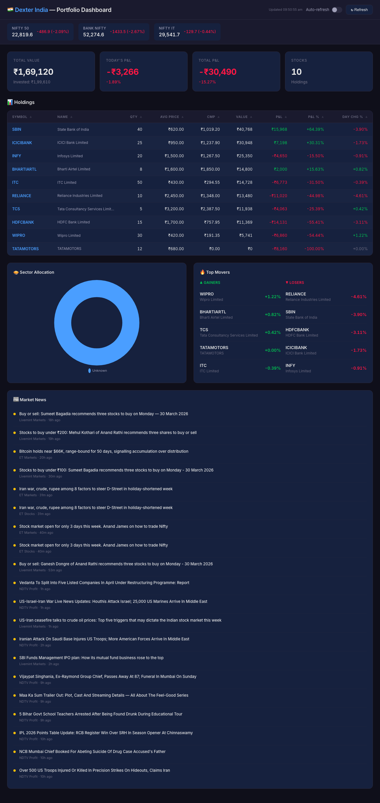
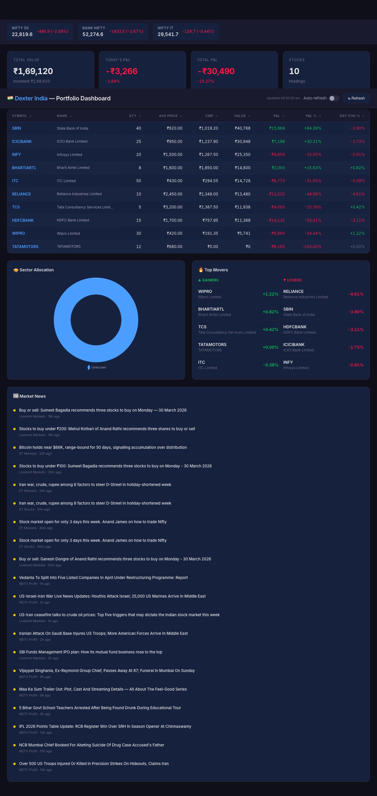
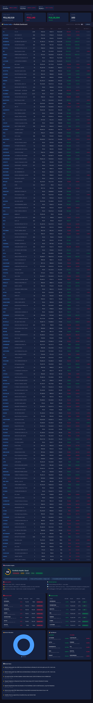

# Dexter India 🇮🇳🤖

An autonomous AI agent for **Indian stock market research** with a real-time **portfolio dashboard**. Built on top of [virattt/dexter](https://github.com/virattt/dexter) — extending it with NSE/BSE live data, Zerodha/Groww portfolio import, and AI-powered buy/hold/sell insights.

> **Think Claude Code, but built specifically for Indian financial research.**

## 📸 Dashboard Preview

### Portfolio Overview — Live Market Data + Holdings


### Charts, Top Movers & Market News


### Full Dashboard with 160+ Stock Portfolio


---

## 🏗️ Architecture

```
┌──────────────────────────────────────────────────────────────────┐
│                        DATA SOURCES                              │
│  ┌─────────────┐  ┌──────────────┐  ┌────────────────────────┐  │
│  │  NSE India   │  │  RSS Feeds   │  │   mfapi.in (MF NAV)   │  │
│  │  Live Quotes │  │ Moneycontrol │  │   Free, No Auth        │  │
│  │  Historical  │  │  ET Markets  │  └────────────────────────┘  │
│  │  Indices     │  │  Livemint    │                              │
│  └──────┬───────┘  │  NDTV Profit │                              │
│         │          └──────┬───────┘                              │
└─────────┼─────────────────┼──────────────────────────────────────┘
          │                 │
          ▼                 ▼
┌──────────────────────────────────────────────────────────────────┐
│                    DEXTER INDIA ENGINE                            │
│                                                                  │
│  ┌──────────────┐  ┌──────────────┐  ┌────────────────────────┐ │
│  │ India Stock   │  │  India News  │  │   Mutual Fund Tools    │ │
│  │ Price Tools   │  │  RSS Parser  │  │   NAV + Search         │ │
│  └──────────────┘  └──────────────┘  └────────────────────────┘ │
│                                                                  │
│  ┌──────────────┐  ┌──────────────┐  ┌────────────────────────┐ │
│  │  Portfolio    │  │  AI Insights │  │   India Market Data    │ │
│  │  CSV Parser   │  │  Engine      │  │   Meta-Tool (Router)   │ │
│  │  SQLite Store │  │  Scoring     │  │   Natural Language     │ │
│  └──────┬───────┘  └──────────────┘  └────────────────────────┘ │
│         │                                                        │
│         │  ┌──────────────────────────────────────┐             │
│         ◄──│  CSV Upload: Zerodha / Groww / XLSX  │             │
│            └──────────────────────────────────────┘             │
└──────────────────────────────────────────────────────────────────┘
          │                 │                    │
          ▼                 ▼                    ▼
┌────────────────┐ ┌────────────────┐ ┌──────────────────┐
│  Web Dashboard │ │  Dexter CLI    │ │  WhatsApp Bot    │
│  localhost:3000│ │  Terminal Agent │ │  (from upstream) │
│                │ │                │ │                  │
│ • Live P&L     │ │ • Ask questions│ │ • Chat interface │
│ • Holdings     │ │ • "How is my   │ │                  │
│ • AI Insights  │ │   portfolio?"  │ │                  │
│ • News Feed    │ │ • Deep research│ │                  │
│ • Charts       │ │                │ │                  │
└────────────────┘ └────────────────┘ └──────────────────┘
```

---

## ✨ Features

### 📊 Portfolio Dashboard
- **Live NSE Data** — Real-time stock prices, Nifty 50, Bank Nifty, Nifty IT indices
- **Drag & Drop CSV Upload** — Auto-detects Zerodha, Groww, and Groww XLSX statement formats
- **Holdings Table** — Sortable by any column, color-coded P&L
- **Sector Allocation** — Interactive pie chart
- **Top Movers** — Today's gainers and losers from your portfolio
- **Market News** — Live RSS feed from Moneycontrol, ET Markets, Livemint, NDTV Profit

### 🧠 AI Portfolio Insights
- **Health Score** (0-100) — Overall portfolio health assessment
- **Signal per Stock** — STRONG_SELL / SELL / HOLD / BUY / STRONG_BUY
- **Risk Alerts** — Concentration risk, value traps, too many positions
- **Opportunities** — Free holdings, multibaggers, averaging down candidates
- **Key Actions** — Prioritized list of what to do next

### 🇮🇳 Indian Market Tools (for the Dexter Agent)
- `get_india_stock_price` — Live NSE quotes (LTP, OHLC, volume, 52-week range)
- `get_india_stock_prices` — Historical OHLCV data
- `get_india_indices` — Nifty 50, Bank Nifty, all NSE indices
- `get_india_news` — RSS feeds from 6 major Indian financial news sources
- `get_mf_nav` — Mutual fund NAV and historical returns
- `search_mf` — Search mutual fund schemes by name
- `get_india_market_data` — Natural language meta-tool (routes to the right sub-tool)
- `upload_portfolio` — Parse and store portfolio from CSV
- `get_portfolio` — Retrieve stored holdings
- `portfolio_summary` — Total value, P&L, sector breakdown

### 💰 Zero Cost
- **No paid APIs** — Uses NSE's free data endpoints
- **No API keys needed** for Indian market features
- RSS feeds for news (free, public)
- mfapi.in for mutual funds (free, no auth)

---

## ✅ Prerequisites

- [Bun](https://bun.com) runtime (v1.0 or higher)
- For the AI agent (optional): OpenAI or Anthropic API key

```bash
# Install Bun (macOS/Linux)
curl -fsSL https://bun.com/install | bash
```

---

## 💻 Installation

```bash
# Clone the repo
git clone https://github.com/HiteshR90/dexter-india.git
cd dexter-india

# Install dependencies
bun install

# (Optional) Set up API keys for the AI agent
cp env.example .env
# Edit .env with your API keys
```

---

## 🚀 Usage

### Start the Portfolio Dashboard

```bash
bun run dashboard
```

Then open **http://localhost:3000** and upload your holdings CSV.

### Supported CSV Formats

**Zerodha** (Console → Portfolio → Holdings → Download)
```
Instrument,Qty.,Avg. cost,LTP,Cur. val,P&L,Net chg.,Day chg.
RELIANCE-EQ,10,2450.00,2520.00,25200.00,700.00,2.86%,0.50%
```

**Groww** (Stocks → Holdings → Download Statement)
```
Stock Name,ISIN,Quantity,Average buy price,Buy value,Closing price,Closing value,Unrealised P&L
RELIANCE INDUSTRIES,INE002A01018,10,2450.00,24500.00,2520.00,25200.00,700.00
```

### Start the AI Agent (Terminal Mode)

```bash
bun start
```

Then ask questions like:
- *"What's the current price of RELIANCE?"*
- *"Give me news about Nifty 50"*
- *"Analyze my portfolio — which stocks should I sell?"*
- *"Search for SBI mutual funds"*

### Start with Watch Mode (Development)

```bash
bun dev
```

---

## 📁 Project Structure (India Additions)

```
src/
├── tools/
│   ├── india/                     # 🇮🇳 Indian market tools
│   │   ├── nse-api.ts             # NSE session management + data fetcher
│   │   ├── india-stock-price.ts   # Live & historical stock prices
│   │   ├── india-news.ts          # RSS news from 6 sources
│   │   ├── india-mf.ts            # Mutual fund NAV (mfapi.in)
│   │   ├── india-market-data.ts   # Natural language meta-tool
│   │   └── index.ts
│   ├── portfolio/                  # 📊 Portfolio management
│   │   ├── csv-parser.ts          # Zerodha + Groww CSV parser
│   │   ├── portfolio-store.ts     # SQLite persistence
│   │   ├── portfolio-tool.ts      # Agent tools
│   │   └── index.ts
│   └── registry.ts                # Updated with India tools
├── dashboard/                      # 🖥️ Web dashboard
│   ├── server.ts                  # Bun HTTP server
│   ├── routes.ts                  # API endpoints
│   ├── insights.ts                # AI insights engine
│   └── public/
│       ├── index.html             # Dashboard UI
│       ├── app.js                 # Frontend logic
│       └── style.css              # Dark theme styles
└── ...existing dexter files
```

---

## 🔌 API Endpoints

| Endpoint | Method | Description |
|----------|--------|-------------|
| `/api/upload` | POST | Upload portfolio CSV (multipart form) |
| `/api/portfolio` | GET | Holdings with live NSE prices |
| `/api/portfolio/analysis` | GET | Sector allocation, top movers |
| `/api/insights` | GET | AI insights — signals, health score, alerts |
| `/api/market` | GET | Live Nifty 50, Bank Nifty, Nifty IT |
| `/api/news` | GET | Market news from RSS feeds |

---

## 🧠 How AI Insights Work

Each stock is scored on multiple factors:

| Factor | Weight | Details |
|--------|--------|---------|
| Total Return | High | >100% gain = multibagger, <-40% = value trap alert |
| Day Momentum | Medium | Sharp falls/rallies flagged |
| 52-Week Position | Medium | Near high = momentum, near low = weak |
| Concentration | Medium | >10% portfolio weight = risk warning |
| Position Size | Low | Tiny positions (<₹3K) flagged for cleanup |
| Free Holdings | Bonus | Bonus/split shares with zero cost = pure alpha |

Signals:
- **STRONG_BUY** (score ≥ 30) — Keep and consider adding
- **BUY** (score ≥ 10) — Hold with confidence
- **HOLD** (score ≥ -10) — Wait and watch
- **SELL** (score ≥ -25) — Review for exit
- **STRONG_SELL** (score < -25) — Exit to free up capital

---

## 🤝 Contributing

1. Fork the repository
2. Create a feature branch (`git checkout -b feature/amazing-feature`)
3. Commit your changes
4. Push to the branch
5. Create a Pull Request

**Ideas for contributions:**
- Add sector auto-mapping from NSE for each stock
- Add Kite Connect integration for auto-sync portfolio
- Add more technical indicators (RSI, MACD, moving averages)
- Add mutual fund portfolio tracking
- Add historical portfolio performance chart
- Add LLM-powered deep analysis per stock

---

## 📄 License

This project is licensed under the MIT License. Built on top of [virattt/dexter](https://github.com/virattt/dexter).

---

## 🙏 Credits

- [virattt/dexter](https://github.com/virattt/dexter) — Original autonomous financial research agent
- [NSE India](https://www.nseindia.com) — Live market data
- [mfapi.in](https://www.mfapi.in) — Free mutual fund NAV API
- [Chart.js](https://www.chartjs.org) — Portfolio charts
